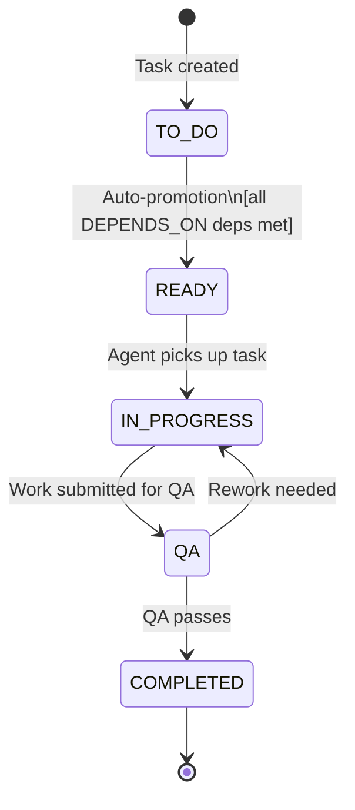
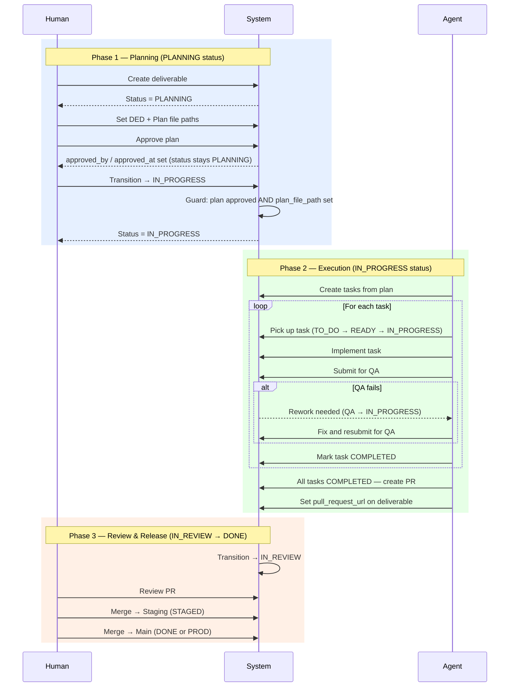

# Deliverable Expectations Document (DED): Deliverables Feature

**Project**: Zazz-Board (Task Blaster)
**Branch**: `deliverables-mvp`
**Created**: 2026-02-16
**Status**: Draft — Awaiting Review
**Author**: Michael Woytowitz + Warp Agent

---

## 1. Problem Statement

Zazz-Board currently manages work at the **task** level only. There is no macro-level concept that groups tasks into a cohesive work product — a feature, bug fix, refactor, or other deliverable. Without this, there is:

- No way to track the lifecycle of a body of work from planning → implementation → PR → merge.
- No connection between a specification (DED), an implementation plan, and the tasks that execute it.
- No mechanism for agents to know when all tasks for a deliverable are complete and a PR should be created.
- No swim lane organization on the Task Graph to visually group tasks by deliverable.
- No dedicated Kanban board for tracking deliverable-level workflow.

This feature introduces **Deliverables** as a first-class entity that sits above tasks in the project hierarchy: `Project → Deliverable → Tasks`.

---

## 2. Definitions

- **Deliverable**: A discrete work product (feature, bug fix, refactor, or other) that provides value or resolves an issue. A deliverable is scoped to a single repo/monorepo and lives within a single Git worktree/branch.
- **DED (Deliverable Expectations Document)**: A markdown document that defines the requirements, scope, and acceptance criteria for a deliverable.
- **Implementation Plan**: A markdown document with detailed technical steps for implementing the deliverable. Derived from the DED.
- **Deliverable Kanban Board**: A board tracking deliverable-level workflow (Planning → In Progress → In Review → Staged → Done).
- **Task Kanban Board**: The existing board, now with columns aligned to the Zazz methodology (To Do → Ready → In Progress → QA → Completed).
- **Task Graph (with Swim Lanes)**: The existing task dependency graph view, now organized into swim lanes per deliverable so each deliverable's sub-graph is visually separated.
- **Zazz Methodology**: Spec-driven development (DED) + test-driven development (tests derived from AC). Tasks are never PR'd individually — only deliverables are PR'd as a branch.
- **Task Ownership**: Tasks are created, worked on, and QA'd by agents. Humans work with DEDs, implementation plans, and deliverable cards. Tasks are displayed for work progress visibility but are agent-managed. Every task belongs to exactly one deliverable.

---

## 3. Scope

### 3.1 In Scope (This DED)

- `DELIVERABLES` database table and schema changes
- `deliverable_id` FK added to `TASKS` table
- Deliverable CRUD API routes (Fastify)
- Deliverable workflow and status tracking with history (JSONB)
- Plan approval tracking (approved_by, approved_at)
- Deliverable Kanban Board UI (new page/route)
- Task Graph modifications: swim lanes per deliverable to organize task sub-graphs
- Task Kanban Board modifications: updated default columns (Zazz methodology), deliverable name footer on cards
- Deliverable list view page with sortable table, copy-to-clipboard for file paths
- New status ENUMs and i18n translations for both deliverable and task workflows
- Refactored ID scheme: deliverables use `{PROJECT_CODE}-{int}` (human-facing), tasks use simple integer IDs (agent-facing)
- Seed data for development and testing
- `git_worktree` and `git_branch` on deliverable (1 worktree per deliverable)
- `pull_request_url` on deliverable (PR is at deliverable level, not task level)
- User stories, acceptance criteria, and API test descriptions

### 3.2 Out of Scope

- Agent skill for automatically creating tasks from an approved plan
- Agent skill for creating PRs when all tasks are complete
- Agent QA workflow (automated QA pass, rework task creation)
- Slack/Teams integration for AC clarification with human PM
- Updating DED or plan markdown documents programmatically
- Multi-repo deliverables (MVP assumes single repo/monorepo)
- PRD (Product Requirements Document) management — field is optional, just a path
- `USERS` table columns for Slack/Teams handles (noted for future DED)

### 3.3 Future Considerations (Noted, Not Specified)

- Agent signals when all deliverable tasks reach `COMPLETED` status
- QA agent rework cycle (create rework tasks → re-QA → PR)
- Slack/Teams handle fields on USERS table for PM communication
- Multi-worktree deliverables spanning multiple repos
- Deliverable dependencies (deliverable-to-deliverable relations)

---

## 4. Deliverable Type Enum

Deliverable types classify the nature of the work product.

| ENUM Value | Display (en) | Description |
|---|---|---|
| `FEATURE` | Feature | New functionality or capability |
| `BUG_FIX` | Bug Fix | Correction of a defect |
| `REFACTOR` | Refactor | Code restructuring without behavior change |
| `ENHANCEMENT` | Enhancement | Improvement to existing functionality |
| `CHORE` | Chore | Maintenance, dependency updates, tooling |
| `DOCUMENTATION` | Documentation | Documentation-only deliverable |

These values must be added to `STATUS_DEFINITIONS` (or a new `DELIVERABLE_TYPE_DEFINITIONS` reference table) and to the TRANSLATIONS table under `deliverables.types.<ENUM>`.

---

## 5. Deliverable Workflow & Status Definitions

### 5.1 Deliverable Statuses (Deliverable Kanban Columns)

Default workflow for new projects (and seed data):

| Order | ENUM Value | Display (en) | Description |
|---|---|---|---|
| 1 | `PLANNING` | Planning | DED and plan being created/refined |
| 2 | `IN_PROGRESS` | In Progress | Plan approved, tasks being worked |
| 3 | `IN_REVIEW` | In Review | PR created, awaiting human review |
| 4 | `STAGED` | Staged | Merged to staging branch |
| 5 | `DONE` | Done | Merged to main, deliverable complete |

New statuses to add to `STATUS_DEFINITIONS` seed data: `STAGED`, `UAT`, `PROD`.

The deliverable workflow array is stored on the `PROJECTS` table as `deliverable_status_workflow` (same pattern as existing `status_workflow` for tasks).

**Workflow flexibility**: Deliverable workflows are fully configurable per project. The default above suits most teams, but projects can define their own columns to match their release pipeline. For example, the **APIMOD** project uses a release-pipeline workflow:

| Order | ENUM Value | Display (en) | Description |
|---|---|---|---|
| 1 | `PLANNING` | Planning | DED and plan being created/refined |
| 2 | `IN_PROGRESS` | In Progress | Plan approved, tasks being worked |
| 3 | `IN_REVIEW` | In Review | PR created, awaiting human review |
| 4 | `UAT` | UAT | User acceptance testing in integration environment |
| 5 | `STAGED` | Staged | Deployed to staging for final validation |
| 6 | `PROD` | Prod | Merged to main and deployed to production (terminal state) |

In this workflow, `PROD` is the terminal state — equivalent to `DONE` in the default workflow. The deliverable is considered complete when its branch is merged to `main` and deployed to production.

The seed data includes **both workflows** to demonstrate and test this flexibility. Task workflows remain fixed to the Zazz methodology across all projects.

#### Deliverable Status Transitions (Default Workflow)

```mermaid
stateDiagram-v2
    [*] --> PLANNING : Deliverable created

    PLANNING --> PLANNING : Approve Plan\n(sets approved_by/approved_at;\nstatus stays PLANNING)
    PLANNING --> IN_PROGRESS : [plan approved AND\nplan_file_path set]

    IN_PROGRESS --> IN_REVIEW : PR created
    IN_REVIEW --> STAGED : Merged to staging
    STAGED --> DONE : Merged to main
```



> **Key detail**: Approving a plan (`PATCH /deliverables/:id/approve`) is a distinct action from transitioning status. Approval sets `approved_by` and `approved_at` but does **not** change the status — the deliverable remains in `PLANNING` until explicitly moved to `IN_PROGRESS`. The `IN_PROGRESS` transition guard validates that both conditions are met.

### 5.2 Task Statuses (Task Kanban Columns — Zazz Methodology)

Default workflow for new projects (and seed data):

| Order | ENUM Value | Display (en) | Description |
|---|---|---|---|
| 1 | `TO_DO` | To Do | Task defined, not yet ready |
| 2 | `READY` | Ready | Dependencies met, available for pickup |
| 3 | `IN_PROGRESS` | In Progress | Actively being worked |
| 4 | `QA` | QA | Quality assurance / acceptance testing |
| 5 | `COMPLETED` | Completed | Task finished and verified |

New statuses to add to `STATUS_DEFINITIONS` seed data: `QA`, `COMPLETED`.

**Key change**: Tasks are never `IN_REVIEW` individually. Tasks move to `COMPLETED` after QA passes. Only the deliverable goes through `IN_REVIEW` when the PR is created.

#### Task Status Transitions



> **Auto-promotion**: When a dependency task's status changes, `checkAndPromoteDependents()` automatically promotes dependent tasks from `TO_DO` → `READY` if all their `DEPENDS_ON` dependencies have reached the project's `completionCriteriaStatus`. This is a system-triggered transition, not user-initiated.

### 5.3 Status History Tracking

Each deliverable tracks its status change history as a JSONB array column (`status_history`):

```json
[
  { "status": "PLANNING", "changedAt": "2026-02-16T10:00:00Z", "changedBy": 5 },
  { "status": "IN_PROGRESS", "changedAt": "2026-02-17T14:30:00Z", "changedBy": 5 },
  { "status": "IN_REVIEW", "changedAt": "2026-02-20T09:00:00Z", "changedBy": null }
]
```

This enables reporting on time spent in each status phase.

### 5.4 Zazz Methodology — End-to-End Lifecycle

The following sequence diagram shows the full lifecycle of a deliverable from specification through deployment. It illustrates the handoffs between Human, System, and Agent actors and the corresponding deliverable status at each phase.



**Phase ↔ Status mapping**:
- **Phase 1** (Planning) = deliverable in `PLANNING`. Human authors the DED, writes the plan, and approves it. The deliverable stays in `PLANNING` until explicitly transitioned.
- **Phase 2** (Execution) = deliverable in `IN_PROGRESS`. Agents create tasks, implement them, and run QA. Each task cycles through `TO_DO → READY → IN_PROGRESS → QA → COMPLETED`.
- **Phase 3** (Review & Release) = deliverable moves through `IN_REVIEW → STAGED → DONE` (or `→ UAT → STAGED → PROD` for projects with a release-pipeline workflow).

---

## 6. Database Schema

### 6.1 New Table: DELIVERABLES

```sql
CREATE TABLE DELIVERABLES (
  id              SERIAL PRIMARY KEY,
  project_id      INTEGER NOT NULL REFERENCES PROJECTS(id) ON DELETE CASCADE,
  deliverable_id  VARCHAR(20) NOT NULL UNIQUE,  -- Human-readable: "ZAZZ-1", "APIMOD-3"
  name            VARCHAR(30) NOT NULL,          -- Short name, fits on Kanban card
  description     TEXT,                          -- Longer description (optional)
  type            VARCHAR(25) NOT NULL,          -- ENUM: FEATURE, BUG_FIX, REFACTOR, ENHANCEMENT, CHORE, DOCUMENTATION
  status          VARCHAR(25) NOT NULL DEFAULT 'PLANNING',
  status_history  JSONB NOT NULL DEFAULT '[]',   -- Array of {status, changedAt, changedBy}

  -- Document paths (markdown files)
  ded_file_path   VARCHAR(500),                  -- Path to DED markdown (repo-relative or shared drive URL)
  plan_file_path  VARCHAR(500),                  -- Path to implementation plan markdown (REQUIRED for approval)
  prd_file_path   VARCHAR(500),                  -- Path to PRD markdown (optional)

  -- Plan approval
  approved_by     INTEGER REFERENCES USERS(id) ON DELETE SET NULL,
  approved_at     TIMESTAMP WITH TIME ZONE,

  -- Git integration
  git_worktree    VARCHAR(255),                  -- Worktree root directory name (= branch name)
  git_branch      VARCHAR(255),                  -- Git branch name (= worktree dir name for clarity)
  pull_request_url VARCHAR(500),                 -- PR URL, set when PR is created
  position        INTEGER NOT NULL DEFAULT 0,     -- Sparse numbering for Kanban drag-and-drop ordering

  -- Audit
  created_by      INTEGER REFERENCES USERS(id) ON DELETE SET NULL,
  created_at      TIMESTAMP WITH TIME ZONE DEFAULT NOW() NOT NULL,
  updated_by      INTEGER REFERENCES USERS(id) ON DELETE SET NULL,
  updated_at      TIMESTAMP WITH TIME ZONE DEFAULT NOW() NOT NULL
);
```

**Drizzle ORM schema** (follows existing patterns in `api/lib/db/schema.js`):

```javascript
// Deliverable type enum
export const deliverableTypeEnum = pgEnum('deliverable_type', [
  'FEATURE', 'BUG_FIX', 'REFACTOR', 'ENHANCEMENT', 'CHORE', 'DOCUMENTATION'
]);

export const DELIVERABLES = pgTable('DELIVERABLES', {
  id: serial('id').primaryKey(),
  project_id: integer('project_id').notNull().references(() => PROJECTS.id, { onDelete: 'cascade' }),
  deliverable_id: varchar('deliverable_id', { length: 20 }).notNull().unique(),
  name: varchar('name', { length: 30 }).notNull(),
  description: text('description'),
  type: deliverableTypeEnum('type').notNull(),
  status: varchar('status', { length: 25 }).notNull().default('PLANNING'),
  status_history: text('status_history').notNull().default('[]'), // JSONB as text (matches TRANSLATIONS pattern)

  ded_file_path: varchar('ded_file_path', { length: 500 }),
  plan_file_path: varchar('plan_file_path', { length: 500 }),
  prd_file_path: varchar('prd_file_path', { length: 500 }),

  approved_by: integer('approved_by').references(() => USERS.id, { onDelete: 'set null' }),
  approved_at: timestamp('approved_at', { withTimezone: true }),

  git_worktree: varchar('git_worktree', { length: 255 }),
  git_branch: varchar('git_branch', { length: 255 }),
  pull_request_url: varchar('pull_request_url', { length: 500 }),
  position: integer('position').notNull().default(0),

  created_by: integer('created_by').references(() => USERS.id, { onDelete: 'set null' }),
  created_at: timestamp('created_at', { withTimezone: true }).defaultNow().notNull(),
  updated_by: integer('updated_by').references(() => USERS.id, { onDelete: 'set null' }),
  updated_at: timestamp('updated_at', { withTimezone: true }).defaultNow().notNull(),
});
```

### 6.2 Modified Table: TASKS

Significant schema changes to align with the Zazz methodology where tasks are agent-facing work items identified by integer IDs and associated with deliverables.

**Changes:**
1. **Drop `task_id` VARCHAR column** — The human-readable `{PROJECT_CODE}-{int}` format (e.g., `ZAZZ-1`) moves to `deliverable_id` on the DELIVERABLES table. Tasks are identified solely by their serial `id` (integer PK). This is a clean break (nuke-and-rebuild).
2. **Add `deliverable_id` FK column** — Integer NOT NULL, references `DELIVERABLES.id`. Every task belongs to a deliverable. ON DELETE CASCADE (deleting a deliverable deletes its tasks).
3. **Remove `git_pull_request_url`** — PRs are at the deliverable level in the Zazz methodology, not per-task.
4. **`git_worktree` remains** — Inherited from the deliverable but retained on tasks for agent convenience.
5. **`project_id` remains** — Even though tasks get their project through the deliverable, `project_id` is retained for query efficiency.

**Column changes (Drizzle):**

```javascript
// REMOVE from TASKS:
// task_id: varchar('task_id', { length: 50 }).notNull().unique(),    ← DROP
// git_pull_request_url: varchar('git_pull_request_url'),             ← DROP

// ADD to TASKS:
deliverable_id: integer('deliverable_id').notNull().references(() => DELIVERABLES.id, { onDelete: 'cascade' }),
```

**Impact of dropping `task_id`:**
- API responses: tasks identified by integer `id` only
- Client: `TaskCard` displays integer `id` instead of `ZAZZ-1` style badge
- Seed data: task seeds no longer include `task_id` values
- Test fixtures: all task references use integer `id`
- The existing `next_task_sequence` logic on PROJECTS that generated `ZAZZ-1` is repurposed for `next_deliverable_sequence` to generate `deliverable_id` (see Section 6.3)

### 6.3 Modified Table: PROJECTS

**Changes:**
1. **Repurpose `next_task_sequence` → `next_deliverable_sequence`** — The existing integer sequence column that generated task IDs is renamed and repurposed to generate `deliverable_id` values (e.g., `ZAZZ-1`, `ZAZZ-2`). Same auto-increment-on-create pattern, same column position. Tasks no longer need a sequence — they use their serial PK.
2. **Update `status_workflow` default** — Change from `['TO_DO', 'IN_PROGRESS', 'IN_REVIEW', 'DONE']` to the Zazz methodology defaults: `['TO_DO', 'READY', 'IN_PROGRESS', 'QA', 'COMPLETED']`.
3. **Add `deliverable_status_workflow`** — New varchar array column for deliverable Kanban columns.

```javascript
// RENAME on PROJECTS:
// next_task_sequence → next_deliverable_sequence  (same pattern, generates deliverable_id)
next_deliverable_sequence: integer('next_deliverable_sequence').notNull().default(1),

// UPDATE default on PROJECTS:
status_workflow: varchar('status_workflow', { length: 25 }).array().notNull()
  .default(sql`ARRAY['TO_DO', 'READY', 'IN_PROGRESS', 'QA', 'COMPLETED']::varchar[]`),

// ADD to PROJECTS:
deliverable_status_workflow: varchar('deliverable_status_workflow', { length: 25 })
  .array().notNull()
  .default(sql`ARRAY['PLANNING', 'IN_PROGRESS', 'IN_REVIEW', 'STAGED', 'DONE']::varchar[]`),
```

### 6.4 Drizzle Relations

```javascript
export const deliverablesRelations = relations(DELIVERABLES, ({ one, many }) => ({
  project: one(PROJECTS, {
    fields: [DELIVERABLES.project_id],
    references: [PROJECTS.id],
  }),
  approvedByUser: one(USERS, {
    fields: [DELIVERABLES.approved_by],
    references: [USERS.id],
  }),
  tasks: many(TASKS),
}));

// Update existing tasksRelations to include:
// deliverable: one(DELIVERABLES, {
//   fields: [TASKS.deliverable_id],
//   references: [DELIVERABLES.id],
// }),

// Update projectsRelations to include:
// deliverables: many(DELIVERABLES),
```

### 6.5 Entity Relationship Summary

```
PROJECTS (1) ──── (N) DELIVERABLES (1) ──── (N) TASKS
    │                      │
    │                      ├── approved_by → USERS
    │                      ├── created_by → USERS
    │                      └── updated_by → USERS
    │
    ├── leader_id → USERS
    ├── status_workflow (task columns)
    └── deliverable_status_workflow (deliverable columns)
```

---

## 7. API Specification (Fastify Routes)

All routes require `TB_TOKEN` authentication header (existing `authMiddleware`).

### 7.1 Deliverable CRUD

#### GET /projects/:projectId/deliverables
List all deliverables for a project.

**Query parameters:**
- `status` (optional): Filter by deliverable status enum
- `type` (optional): Filter by deliverable type enum

**Response** `200`:
```json
[
  {
    "id": 1,
    "deliverableId": "ZAZZ-1",
    "name": "Deliverables Feature",
    "description": "Add deliverable entity, Kanban board, and task graph swim lanes",
    "type": "FEATURE",
    "status": "IN_PROGRESS",
    "statusHistory": [...],
    "dedFilePath": "docs/deliverables_feature_DED.md",
    "planFilePath": "docs/deliverables_feature_plan.md",
    "prdFilePath": null,
    "approvedBy": 5,
    "approvedByName": "Michael Woytowitz",
    "approvedAt": "2026-02-17T14:30:00Z",
    "gitWorktree": "deliverables-mvp",
    "gitBranch": "deliverables-mvp",
    "pullRequestUrl": null,
    "taskCount": 6,
    "completedTaskCount": 1,
    "projectId": 1,
    "projectCode": "ZAZZ",
    "createdBy": 5,
    "createdAt": "2026-02-16T10:00:00Z",
    "updatedAt": "2026-02-17T14:30:00Z"
  }
]
```

#### GET /deliverables/:id
Get a single deliverable by its serial `id`.

**Response** `200`: Full deliverable object (same shape as list item above).
**Response** `404`: `{ "error": "Deliverable not found" }`

#### POST /projects/:projectId/deliverables
Create a new deliverable for a project.

**Request body:**
```json
{
  "name": "Homepage Redesign",
  "description": "Full redesign of the homepage with modern components",
  "type": "FEATURE",
  "dedFilePath": "docs/homepage-redesign-DED.md",
  "planFilePath": "docs/homepage-redesign-plan.md",
  "prdFilePath": "docs/homepage-redesign-PRD.md",
  "gitWorktree": "homepage-redesign",
  "gitBranch": "homepage-redesign"
}
```

**Required fields**: `name`, `type`
**Auto-generated**: `deliverableId` (format `{PROJECT_CODE}-{next_deliverable_sequence}`), `status` (`PLANNING`), initial `statusHistory` entry.

**Response** `201`: Created deliverable object.

#### PUT /deliverables/:id
Update a deliverable.

**Request body** (all fields optional):
```json
{
  "name": "Homepage Redesign v2",
  "description": "Updated description...",
  "type": "FEATURE",
  "dedFilePath": "docs/homepage-redesign-DED.md",
  "planFilePath": "docs/homepage-redesign-plan.md",
  "prdFilePath": "docs/homepage-redesign-PRD.md",
  "gitWorktree": "homepage-redesign",
  "gitBranch": "homepage-redesign",
  "pullRequestUrl": "https://github.com/org/repo/pull/42"
}
```

**Response** `200`: Updated deliverable object.
**Response** `404`: `{ "error": "Deliverable not found" }`

#### DELETE /deliverables/:id
Delete a deliverable. CASCADE deletes all associated tasks (tasks cannot exist without a deliverable).

**Response** `200`: `{ "message": "Deliverable deleted successfully" }`
**Response** `404`: `{ "error": "Deliverable not found" }`

### 7.2 Deliverable Status Transitions

#### PATCH /deliverables/:id/status
Change a deliverable's status. Appends to `status_history`.

**Request body:**
```json
{
  "status": "IN_PROGRESS"
}
```

**Validation:**
- Status must exist in `STATUS_DEFINITIONS`
- Status must be in the project's `deliverable_status_workflow`
- Transitioning to `IN_PROGRESS` requires `plan_file_path` to be set and `approved_at` to be non-null

**Response** `200`: Updated deliverable with new status and appended history.
**Response** `400`: `{ "error": "Cannot move to IN_PROGRESS without an approved plan" }`

### 7.3 Plan Approval

#### PATCH /deliverables/:id/approve
Approve the implementation plan for a deliverable. Sets `approved_by` to the authenticated user and `approved_at` to the current timestamp.

**Validation:**
- `plan_file_path` must be set on the deliverable
- Deliverable must currently be in `PLANNING` status
- Cannot re-approve if already approved

**Request body:** (empty — approval user comes from auth context)

**Response** `200`:
```json
{
  "id": 1,
  "deliverableId": "ZAZZ-1",
  "approvedBy": 5,
  "approvedByName": "Michael Woytowitz",
  "approvedAt": "2026-02-17T14:30:00Z",
  "status": "PLANNING",
  ...
}
```

**Response** `400`: `{ "error": "Plan file path must be set before approval" }`

### 7.4 Deliverable Tasks

#### GET /deliverables/:id/tasks
Get all tasks linked to a deliverable.

**Response** `200`: Array of task objects (same shape as existing `GET /projects/:id/tasks`).

### 7.5 Project Deliverable Workflow Configuration

#### GET /projects/:code/deliverable-statuses
Returns the project's ordered deliverable status workflow.

**Response** `200`:
```json
{
  "deliverableStatusWorkflow": ["PLANNING", "IN_PROGRESS", "IN_REVIEW", "STAGED", "DONE"]
}
```

#### PUT /projects/:code/deliverable-statuses
Update the project's deliverable status workflow.

**Request body:**
```json
{
  "deliverableStatusWorkflow": ["PLANNING", "IN_PROGRESS", "IN_REVIEW", "STAGED", "DONE"]
}
```

**Validation:** All codes must exist in `STATUS_DEFINITIONS`. Cannot remove a status that has active deliverables.

### 7.6 Updated Task Routes

#### POST /tasks (modified)
`deliverableId` is now **required**. The `projectId` is derived from the deliverable but still accepted for backward compatibility (validated against the deliverable's project).
```json
{
  "title": "Build header component",
  "deliverableId": 1
}
```

#### PUT /tasks/:id (modified)
Allow changing `deliverableId` to reassign a task to a different deliverable. Cannot be set to null.

---

## 8. UI Specification (React Client)

### 8.1 New Route: Deliverable List Page

**Route**: `/projects/:projectCode/deliverables`

A sortable table listing all deliverables for the selected project.

**Table columns:**
| Column | Sortable | Description |
|---|---|---|
| Deliverable ID | Yes | Human-readable ID (e.g., `ZAZZ-1`) |
| Name | Yes | Short name (max 30 chars) |
| Type | Yes | FEATURE, BUG_FIX, etc. (translated) |
| Status | Yes | Current status (translated, color-coded badge) |
| Status Changed | Yes | Datetime of last status change |
| DED Path | No | File path with copy-to-clipboard icon button |
| Plan Path | No | File path with copy-to-clipboard icon button |
| PRD Path | No | File path with copy-to-clipboard icon button (if set) |
| PR URL | No | Link to PR (if set) |
| Tasks | Yes | Completed / Total count |

**Copy-to-clipboard behavior**: Each file path cell displays the path text (truncated if long) with a clipboard icon (e.g., `IconCopy` from Tabler). Clicking the icon copies the full path to the clipboard and shows a brief "Copied!" tooltip. This allows the user to paste the path into a terminal or IDE to open/edit the markdown.

**Components**: `DeliverableListPage.jsx`, `DeliverableTable.jsx`

### 8.2 New Route: Deliverable Kanban Board

**Route**: `/projects/:projectCode/deliverable-kanban`

A Kanban board for deliverable cards. Columns come from `project.deliverableStatusWorkflow`.

**Default columns**: Planning | In Progress | In Review | Staged | Done

**Deliverable card contents:**
- Deliverable ID badge (top, styled like task cards)
- Name (max 30 chars)
- Type badge (color-coded by type)
- Task progress: `3/8 tasks completed` progress bar
- PR URL link (if set, small icon link)
- Approved badge (if plan is approved)

**Drag-and-drop**: Same pattern as task Kanban (@dnd-kit). Sparse position numbering.

**Components**: `DeliverableKanbanPage.jsx`, `DeliverableKanbanBoard.jsx`, `DeliverableCard.jsx`

### 8.3 Modified: Task Kanban Board — Updated Default Columns

**Route** (existing): `/projects/:projectCode/kanban`

**Changes:**
1. **Default columns** (Zazz methodology): To Do | Ready | In Progress | QA | Completed
2. **Card footer**: Each task card displays a small footer badge with the deliverable name, providing context about which deliverable the task belongs to.

**Components modified**: `KanbanBoard.jsx`, `TaskCard.jsx`

### 8.4 Modified: Task Graph — Swim Lanes per Deliverable

**Route** (existing): `/projects/:projectCode/taskGraph`

**Changes:**
1. **Swim lanes**: The task dependency graph is organized into horizontal swim lanes grouped by deliverable. Each swim lane has a header showing the deliverable name.
2. Each swim lane contains the sub-graph (nodes + dependency edges) for that deliverable's tasks.
3. Cross-deliverable dependency edges span across swim lanes.

**Swim lane rendering order**: Deliverables ordered by their `status` (IN_PROGRESS first, then PLANNING, etc.).

**Components modified**: `TaskGraphPage.jsx`, graph rendering components in `client/src/components/graph/`

### 8.5 Modified: Task Card Footer

Add a footer section to `TaskCard.jsx`:

```jsx
<Box style={{ borderTop: '1px solid var(--mantine-color-gray-3)', padding: '4px 12px' }}>
  <Text size="xs" c="dimmed" truncate>
    📦 {task.deliverableName}
  </Text>
</Box>
```

### 8.6 Navigation Updates

Add the Deliverable views to the project-level navigation (the existing `SegmentedControl` or a new nav):

| View | Route | Icon |
|---|---|---|
| Kanban (Tasks) | `/projects/:code/kanban` | IconLayoutKanban |
| Task Graph | `/projects/:code/taskGraph` | IconGitBranch |
| Deliverables (List) | `/projects/:code/deliverables` | IconListDetails |
| Deliverable Board | `/projects/:code/deliverable-kanban` | IconColumns |

### 8.7 i18n Translations

Add the following keys to all 4 language files and the `seedTranslations.js` seeder:

```json
{
  "deliverables": {
    "title": "Deliverables",
    "createDeliverable": "Create Deliverable",
    "editDeliverable": "Edit Deliverable",
    "name": "Name",
    "description": "Description",
    "type": "Type",
    "status": "Status",
    "dedFilePath": "DED File Path",
    "planFilePath": "Plan File Path",
    "prdFilePath": "PRD File Path",
    "pullRequestUrl": "Pull Request URL",
    "gitWorktree": "Git Worktree",
    "gitBranch": "Git Branch",
    "approvedBy": "Approved By",
    "approvedAt": "Approved At",
    "approvePlan": "Approve Plan",
    "planNotSet": "Plan file path must be set before approval",
    "noDeliverables": "No deliverables found for this project",
    "copiedToClipboard": "Copied to clipboard!",
    "taskProgress": "Task Progress",
    "types": {
      "FEATURE": "Feature",
      "BUG_FIX": "Bug Fix",
      "REFACTOR": "Refactor",
      "ENHANCEMENT": "Enhancement",
      "CHORE": "Chore",
      "DOCUMENTATION": "Documentation"
    },
    "statuses": {
      "PLANNING": "Planning",
      "IN_PROGRESS": "In Progress",
      "IN_REVIEW": "In Review",
      "UAT": "UAT",
      "STAGED": "Staged",
      "PROD": "Prod",
      "DONE": "Done"
    },
    "statusDescriptions": {
      "PLANNING": "DED and implementation plan being created or refined",
      "IN_PROGRESS": "Plan approved, tasks actively being worked",
      "IN_REVIEW": "PR created, awaiting human review",
      "UAT": "User acceptance testing in integration environment",
      "STAGED": "Deployed to staging for final validation",
      "PROD": "Merged to main and deployed to production",
      "DONE": "Merged to main, deliverable complete"
    }
  },
  "tasks": {
    "statuses": {
      "QA": "QA",
      "COMPLETED": "Completed"
    },
    "statusDescriptions": {
      "QA": "Task undergoing quality assurance and acceptance testing",
      "COMPLETED": "Task finished and verified against acceptance criteria"
    }
  }
}
```

---

## 9. Seed Data

### 9.1 New Status Definitions

Add to `seedStatusDefinitions.js`:

```javascript
{ code: 'STAGED', description: 'Merged to staging branch for integration testing' },
{ code: 'UAT', description: 'User acceptance testing in integration environment' },
{ code: 'PROD', description: 'Merged to main and deployed to production (terminal state)' },
{ code: 'QA', description: 'Task undergoing quality assurance and acceptance testing' },
{ code: 'COMPLETED', description: 'Task finished and verified against acceptance criteria' },
```

### 9.2 Project Seed Data (Updated)

All projects use Zazz methodology defaults. The primary test project is renamed to **Zazz** with code **ZAZZ**. The existing `next_task_sequence` column is repurposed as `next_deliverable_sequence`.

```javascript
[
  {
    title: 'Zazz Board',
    code: 'ZAZZ',
    description: 'Zazz-Board application development — primary test project',
    leader_id: 5,
    next_deliverable_sequence: 4,  // 3 deliverables seeded
    status_workflow: ['TO_DO', 'READY', 'IN_PROGRESS', 'QA', 'COMPLETED'],
    deliverable_status_workflow: ['PLANNING', 'IN_PROGRESS', 'IN_REVIEW', 'STAGED', 'DONE'],
    task_graph_layout_direction: 'LR',
    completion_criteria_status: 'COMPLETED',
    created_by: 5
  },
  {
    title: 'Mobile App Development',
    code: 'MOBDEV',
    description: 'Native mobile app for iOS and Android platforms',
    leader_id: 2,
    next_deliverable_sequence: 2,  // 1 deliverable seeded
    status_workflow: ['TO_DO', 'READY', 'IN_PROGRESS', 'QA', 'COMPLETED'],
    deliverable_status_workflow: ['PLANNING', 'IN_PROGRESS', 'IN_REVIEW', 'STAGED', 'DONE'],
    created_by: 2
  },
  {
    title: 'API Modernization',
    code: 'APIMOD',
    description: 'Migrate legacy APIs to modern REST architecture',
    leader_id: 3,
    next_deliverable_sequence: 3,  // 2 deliverables seeded
    status_workflow: ['TO_DO', 'READY', 'IN_PROGRESS', 'QA', 'COMPLETED'],
    deliverable_status_workflow: ['PLANNING', 'IN_PROGRESS', 'IN_REVIEW', 'UAT', 'STAGED', 'PROD'],
    task_graph_layout_direction: 'LR',
    completion_criteria_status: 'COMPLETED',
    created_by: 3
  },
  {
    title: 'Database Migration',
    code: 'DATAMIG',
    description: 'Migrate all customer data to new clustered database',
    leader_id: 5,
    next_deliverable_sequence: 1,
    status_workflow: ['TO_DO', 'READY', 'IN_PROGRESS', 'QA', 'COMPLETED'],
    deliverable_status_workflow: ['PLANNING', 'IN_PROGRESS', 'IN_REVIEW', 'STAGED', 'DONE'],
    created_by: 5
  },
  {
    title: 'Security Compliance',
    code: 'SECURE',
    description: 'Annual security audit and compliance updates',
    leader_id: 4,
    next_deliverable_sequence: 1,
    status_workflow: ['TO_DO', 'READY', 'IN_PROGRESS', 'QA', 'COMPLETED'],
    deliverable_status_workflow: ['PLANNING', 'IN_PROGRESS', 'IN_REVIEW', 'STAGED', 'DONE'],
    created_by: 4
  }
]
```

### 9.3 Deliverable Seed Data

New seeder: `seedDeliverables.js`

Deliverables span multiple projects and statuses. ZAZZ is the primary test project with 3 deliverables in varied states:

```javascript
[
  {
    project_id: 1, // ZAZZ
    deliverable_id: 'ZAZZ-1',
    name: 'Deliverables Feature',
    description: 'Add deliverable entity, Kanban board, and task graph swim lanes',
    type: 'FEATURE',
    status: 'IN_PROGRESS',
    position: 10,
    status_history: JSON.stringify([
      { status: 'PLANNING', changedAt: '2026-01-15T10:00:00Z', changedBy: 5 },
      { status: 'IN_PROGRESS', changedAt: '2026-01-20T14:30:00Z', changedBy: 5 }
    ]),
    ded_file_path: 'docs/deliverables_feature_DED.md',
    plan_file_path: 'docs/deliverables_feature_plan.md',
    approved_by: 5,
    approved_at: '2026-01-20T14:30:00Z',
    git_worktree: 'deliverables-mvp',
    git_branch: 'deliverables-mvp',
    created_by: 5
  },
  {
    project_id: 1, // ZAZZ
    deliverable_id: 'ZAZZ-2',
    name: 'Agent Skill Framework',
    description: 'Define and register agent skills for task creation and QA',
    type: 'FEATURE',
    status: 'PLANNING',
    position: 20,
    status_history: JSON.stringify([
      { status: 'PLANNING', changedAt: '2026-02-10T09:00:00Z', changedBy: 5 }
    ]),
    ded_file_path: 'docs/agent-skills-DED.md',
    created_by: 5
  },
  {
    project_id: 1, // ZAZZ
    deliverable_id: 'ZAZZ-3',
    name: 'Fix Tag Validation Bug',
    description: 'Tags with trailing hyphens bypass API validation',
    type: 'BUG_FIX',
    status: 'IN_REVIEW',
    position: 30,
    status_history: JSON.stringify([
      { status: 'PLANNING', changedAt: '2026-02-01T10:00:00Z', changedBy: 5 },
      { status: 'IN_PROGRESS', changedAt: '2026-02-02T09:00:00Z', changedBy: 5 },
      { status: 'IN_REVIEW', changedAt: '2026-02-05T16:00:00Z', changedBy: null }
    ]),
    ded_file_path: 'docs/fix-tag-validation-DED.md',
    plan_file_path: 'docs/fix-tag-validation-plan.md',
    approved_by: 5,
    approved_at: '2026-02-02T09:00:00Z',
    git_worktree: 'fix-tag-validation',
    git_branch: 'fix-tag-validation',
    pull_request_url: 'https://github.com/michaelwitz/task-blaster/pull/12',
    created_by: 5
  },
  {
    project_id: 2, // MOBDEV
    deliverable_id: 'MOBDEV-1',
    name: 'Auth Screens',
    description: 'Login, registration, and password reset screens',
    type: 'FEATURE',
    status: 'IN_PROGRESS',
    position: 10,
    status_history: JSON.stringify([
      { status: 'PLANNING', changedAt: '2026-01-20T08:00:00Z', changedBy: 2 },
      { status: 'IN_PROGRESS', changedAt: '2026-01-25T10:00:00Z', changedBy: 2 }
    ]),
    ded_file_path: 'docs/mobdev-auth-screens-DED.md',
    plan_file_path: 'docs/mobdev-auth-screens-plan.md',
    approved_by: 2,
    approved_at: '2026-01-25T10:00:00Z',
    git_worktree: 'auth-screens',
    git_branch: 'auth-screens',
    created_by: 2
  },
  {
    project_id: 3, // APIMOD
    deliverable_id: 'APIMOD-1',
    name: 'REST Endpoint Migration',
    description: 'Migrate legacy endpoints to modern REST with OpenAPI spec',
    type: 'REFACTOR',
    status: 'IN_PROGRESS',
    position: 10,
    status_history: JSON.stringify([
      { status: 'PLANNING', changedAt: '2026-01-05T08:00:00Z', changedBy: 3 },
      { status: 'IN_PROGRESS', changedAt: '2026-01-12T11:00:00Z', changedBy: 3 }
    ]),
    ded_file_path: 'docs/apimod-rest-migration-DED.md',
    plan_file_path: 'docs/apimod-rest-migration-plan.md',
    approved_by: 3,
    approved_at: '2026-01-12T11:00:00Z',
    git_worktree: 'rest-migration',
    git_branch: 'rest-migration',
    created_by: 3
  },
  {
    project_id: 3, // APIMOD
    deliverable_id: 'APIMOD-2',
    name: 'Fix Auth Token Expiry',
    description: 'Tokens not expiring correctly under high concurrency',
    type: 'BUG_FIX',
    status: 'PROD',
    position: 20,
    status_history: JSON.stringify([
      { status: 'PLANNING', changedAt: '2026-01-28T10:00:00Z', changedBy: 3 },
      { status: 'IN_PROGRESS', changedAt: '2026-01-29T09:00:00Z', changedBy: 3 },
      { status: 'IN_REVIEW', changedAt: '2026-02-01T16:00:00Z', changedBy: null },
      { status: 'UAT', changedAt: '2026-02-02T11:00:00Z', changedBy: 3 },
      { status: 'STAGED', changedAt: '2026-02-03T10:00:00Z', changedBy: 3 },
      { status: 'PROD', changedAt: '2026-02-05T14:00:00Z', changedBy: 3 }
    ]),
    ded_file_path: 'docs/apimod-auth-token-fix-DED.md',
    plan_file_path: 'docs/apimod-auth-token-fix-plan.md',
    approved_by: 3,
    approved_at: '2026-01-29T09:00:00Z',
    git_worktree: 'fix-auth-token-expiry',
    git_branch: 'fix-auth-token-expiry',
    pull_request_url: 'https://github.com/michaelwitz/task-blaster/pull/8',
    created_by: 3
  }
]
```

### 9.4 Task Seed Data (Rewritten)

Tasks no longer have a `task_id` VARCHAR column — they are identified by their serial integer `id`. Tasks reference deliverables via `deliverable_id` FK. All task statuses use the Zazz methodology columns.

Tasks for ZAZZ project (id=1), deliverable ZAZZ-1 (id=1):
```javascript
[
  { project_id: 1, deliverable_id: 1, title: 'Create DELIVERABLES schema', status: 'COMPLETED', priority: 'HIGH', assignee_id: 1, position: 10 },
  { project_id: 1, deliverable_id: 1, title: 'Deliverable CRUD API routes', status: 'IN_PROGRESS', priority: 'HIGH', assignee_id: 1, position: 20 },
  { project_id: 1, deliverable_id: 1, title: 'Deliverable Kanban board UI', status: 'TO_DO', priority: 'MEDIUM', assignee_id: 2, position: 30 },
  { project_id: 1, deliverable_id: 1, title: 'Task graph swim lanes', status: 'TO_DO', priority: 'MEDIUM', assignee_id: 3, position: 40 },
  { project_id: 1, deliverable_id: 1, title: 'Deliverable list page', status: 'READY', priority: 'MEDIUM', assignee_id: 2, position: 50 },
  { project_id: 1, deliverable_id: 1, title: 'Seed data and translations', status: 'QA', priority: 'LOW', assignee_id: 4, position: 60 },
]
```

Tasks for ZAZZ-2 (id=2) — still in PLANNING, no tasks yet.

Tasks for ZAZZ-3 (id=3):
```javascript
[
  { project_id: 1, deliverable_id: 3, title: 'Fix tag regex pattern', status: 'COMPLETED', priority: 'HIGH', assignee_id: 1, position: 10 },
  { project_id: 1, deliverable_id: 3, title: 'Add tag validation tests', status: 'COMPLETED', priority: 'MEDIUM', assignee_id: 1, position: 20 },
]
```

Tasks for MOBDEV-1 (id=4):
```javascript
[
  { project_id: 2, deliverable_id: 4, title: 'Login screen layout', status: 'COMPLETED', priority: 'HIGH', assignee_id: 3, position: 10 },
  { project_id: 2, deliverable_id: 4, title: 'Registration form', status: 'IN_PROGRESS', priority: 'MEDIUM', assignee_id: 2, position: 20 },
  { project_id: 2, deliverable_id: 4, title: 'Password reset flow', status: 'TO_DO', priority: 'MEDIUM', assignee_id: 3, position: 30 },
]
```

Tasks for APIMOD-1 (id=5):
```javascript
[
  { project_id: 3, deliverable_id: 5, title: 'Audit existing endpoints', status: 'COMPLETED', priority: 'HIGH', assignee_id: 4, position: 10 },
  { project_id: 3, deliverable_id: 5, title: 'Design OpenAPI spec', status: 'IN_PROGRESS', priority: 'CRITICAL', assignee_id: 3, position: 20 },
  { project_id: 3, deliverable_id: 5, title: 'Implement versioning', status: 'READY', priority: 'HIGH', assignee_id: 3, position: 30 },
  { project_id: 3, deliverable_id: 5, title: 'Add rate limiting', status: 'TO_DO', priority: 'MEDIUM', assignee_id: 4, position: 40 },
  { project_id: 3, deliverable_id: 5, title: 'Integration test suite', status: 'TO_DO', priority: 'HIGH', assignee_id: 1, position: 50 },
]
```

### 9.5 Reset-and-Seed Script Updates

Modify `reset-and-seed.js`:
1. Drop order: TASK_RELATIONS → TASK_TAGS → TASKS → **DELIVERABLES** → PROJECTS → ... (dependents first)
2. Drop `deliverable_type` enum type
3. Rename `next_task_sequence` → `next_deliverable_sequence` in PROJECTS schema
4. Seed order: users → tags → status definitions → coordination requirements → translations → projects → **deliverables** → tasks → task-tags → task relations
5. Update summary counts to reflect new data

---

## 10. Use Cases

### UC-1: Create a New Deliverable
**Actor**: Human PM / Developer
**Precondition**: User is authenticated. A project exists.
**Flow**:
1. User navigates to the Deliverable List page for a project.
2. User clicks "Create Deliverable."
3. User fills in name (required, max 30 chars), type (dropdown), and optional description.
4. System generates `deliverable_id` as `{PROJECT_CODE}-{next_deliverable_sequence}`.
5. System creates the deliverable with status `PLANNING` and initial status history entry.
6. System increments `next_deliverable_sequence` on the project.
7. Deliverable appears on the list and the Deliverable Kanban in the "Planning" column.

### UC-2: Update Deliverable with Document Paths
**Actor**: Human PM / Developer
**Precondition**: Deliverable exists in PLANNING status.
**Flow**:
1. User opens the deliverable (edit modal or detail view).
2. User sets `ded_file_path`, `plan_file_path`, and optionally `prd_file_path`.
3. User sets `git_worktree` and `git_branch` (typically identical values).
4. System saves the updated deliverable.

### UC-3: Approve an Implementation Plan
**Actor**: Human PM / Tech Lead
**Precondition**: Deliverable has `plan_file_path` set. Status is `PLANNING`.
**Flow**:
1. User views the deliverable detail.
2. User clicks "Approve Plan."
3. System sets `approved_by` to current user, `approved_at` to now.
4. System returns the updated deliverable. Status remains `PLANNING` — it is moved to `IN_PROGRESS` separately (explicitly or by the system when task creation begins).

### UC-4: Transition Deliverable to In Progress
**Actor**: Human PM or System (after agent creates tasks from plan)
**Precondition**: Deliverable is in `PLANNING`, plan is approved.
**Flow**:
1. User (or system) sends `PATCH /deliverables/:id/status` with `{ "status": "IN_PROGRESS" }`.
2. System validates plan is approved and plan_file_path is set.
3. System updates status, appends to status_history.
4. Deliverable card moves to "In Progress" column on Deliverable Kanban.

### UC-5: View Deliverable List with Copy-to-Clipboard
**Actor**: Human Developer
**Precondition**: Project has deliverables.
**Flow**:
1. User navigates to `/projects/ZAZZ/deliverables`.
2. System displays a sortable table of all deliverables.
3. User clicks the copy icon next to a plan file path.
4. Path is copied to clipboard. User pastes into terminal: `code docs/homepage-redesign-plan.md`.

### UC-6: View Task Graph with Swim Lanes
**Actor**: Human Developer / PM
**Precondition**: Project has deliverables with associated tasks.
**Flow**:
1. User navigates to the Task Graph page.
2. System organizes the task dependency graph into swim lanes grouped by deliverable.
3. Each swim lane has a header showing the deliverable name.
4. Dependency edges render within and across swim lanes.

### UC-7: Deliverable Reaches In Review (PR Created)
**Actor**: QA Agent (future) / Human
**Precondition**: All tasks for the deliverable are in `COMPLETED` status.
**Flow**:
1. Agent/user creates a PR for the deliverable's branch.
2. Agent/user updates the deliverable: `PATCH /deliverables/:id` with `{ "pullRequestUrl": "https://github.com/..." }`.
3. Agent/user transitions status: `PATCH /deliverables/:id/status` with `{ "status": "IN_REVIEW" }`.
4. Deliverable card moves to "In Review" column. PR URL is visible on the card and in the list view.

### UC-8: Deliverable Merged and Done
**Actor**: Human Reviewer / CI System
**Precondition**: PR is approved and merged to staging.
**Flow**:
1. After merge to staging: status transitions to `STAGED`.
2. After merge to main: status transitions to `DONE`.
3. Status history captures timestamps for each transition, enabling lead-time reporting.

### UC-9: QA Creates Rework Tasks (Future — Out of Scope for Implementation)
**Actor**: QA Agent
**Precondition**: QA agent has analyzed the deliverable and found issues.
**Flow**:
1. QA agent creates new tasks linked to the deliverable with descriptions of the required fixes.
2. New tasks are placed in the `READY` column of the Task Kanban.
3. Agent workers pick up rework tasks and implement fixes.
4. When all rework tasks are `COMPLETED`, QA agent re-analyzes.
5. Cycle repeats until AC is met, then PR is created.

**Note**: The data model supports this flow (tasks link to deliverables, status tracking is in place). The agent skills and automation are out of scope for this DED.

---

## 11. User Stories

### US-1: Create Deliverable
**As a** project lead,
**I want to** create a new deliverable for my project with a name and type,
**So that** I can define a unit of work that groups related tasks and tracks their lifecycle from planning to merge.

### US-2: Attach Specification Documents
**As a** project lead,
**I want to** set file paths for the DED, implementation plan, and optional PRD on a deliverable,
**So that** team members and agents can find and reference the specification documents.

### US-3: Approve Plan
**As a** tech lead,
**I want to** approve the implementation plan for a deliverable,
**So that** agents know the plan is finalized and task creation can begin.

### US-4: Track Deliverable Status
**As a** project manager,
**I want to** see each deliverable's current status and the full history of status changes with timestamps,
**So that** I can track progress, identify bottlenecks, and report on lead times.

### US-5: View Deliverable Kanban Board
**As a** project manager,
**I want to** see deliverables on a Kanban board with columns for Planning, In Progress, In Review, Staged, and Done,
**So that** I have a visual overview of all deliverable progress at a glance.

### US-6: View Task Graph with Swim Lanes
**As a** developer,
**I want to** see tasks grouped by deliverable in swim lanes on the Task Graph,
**So that** I can quickly see each deliverable's sub-graph and understand task dependencies within and across deliverables.

### US-7: Copy File Path to Clipboard
**As a** developer,
**I want to** click a copy icon next to a DED or plan file path in the deliverable list,
**So that** I can quickly open the document in my IDE or terminal without manually typing the path.

### US-8: See Deliverable Name on Task Cards
**As a** developer,
**I want to** see which deliverable a task belongs to in the task card footer,
**So that** I have immediate context about what work product the task contributes to.

### US-9: Navigate Between Views
**As a** user,
**I want to** switch between the Task Kanban, Task Graph, Deliverable List, and Deliverable Kanban views from the project navigation,
**So that** I can choose the appropriate view for my current needs.

### US-10: Deliverable List with Sorting
**As a** project manager,
**I want to** sort the deliverable list by any column (ID, name, type, status, status date, task count),
**So that** I can prioritize my attention on deliverables that need it most.

### US-11: Link Deliverable to Git Worktree
**As a** developer,
**I want to** specify the Git worktree and branch for a deliverable,
**So that** the system (and agents) know which worktree to perform work in.

### US-12: Track PR at Deliverable Level
**As a** project lead,
**I want to** see the PR URL on the deliverable card and list view,
**So that** I can quickly navigate to the PR for review.

### US-13: Create Deliverable with Correct ID Sequence
**As a** user,
**I want** deliverable IDs to follow the `{PROJECT_CODE}-{sequence}` format (e.g., ZAZZ-1, ZAZZ-2),
**So that** deliverables have stable, human-readable identifiers for communication and documentation.

---

## 12. Acceptance Criteria

### AC-1: DELIVERABLES Table
- [ ] `DELIVERABLES` table exists with all columns defined in Section 6.1
- [ ] `deliverable_id` is unique across the database
- [ ] `deliverable_id` follows format `{PROJECT_CODE}-{int}` (e.g., `ZAZZ-1`)
- [ ] `position` column supports sparse numbering for Kanban drag-and-drop ordering
- [ ] `project_id` FK cascade-deletes deliverables when a project is deleted
- [ ] `status_history` stores valid JSON array of `{status, changedAt, changedBy}` objects
- [ ] `name` column max length is 30 characters
- [ ] `type` uses the `deliverable_type` pgEnum

### AC-2: TASKS Table Modification
- [ ] `task_id` VARCHAR column is dropped from TASKS table
- [ ] `git_pull_request_url` column is dropped from TASKS table
- [ ] `TASKS` table has a `deliverable_id` integer NOT NULL column referencing `DELIVERABLES(id)`
- [ ] Deleting a deliverable CASCADE deletes all associated tasks
- [ ] Task API responses include `deliverableId` and `deliverableName` fields
- [ ] Tasks are identified by their serial integer `id` only (no human-readable string ID)
- [ ] `POST /tasks` requires `deliverableId`

### AC-3: PROJECTS Table Modification
- [ ] `next_task_sequence` is renamed to `next_deliverable_sequence` (repurposed)
- [ ] `status_workflow` default is `['TO_DO', 'READY', 'IN_PROGRESS', 'QA', 'COMPLETED']`
- [ ] `PROJECTS` table has `deliverable_status_workflow` varchar array column
- [ ] `deliverable_status_workflow` default is `['PLANNING', 'IN_PROGRESS', 'IN_REVIEW', 'STAGED', 'DONE']`

### AC-4: Deliverable CRUD API
- [ ] `GET /projects/:projectId/deliverables` returns all deliverables for a project
- [ ] `GET /projects/:projectId/deliverables` supports `status` and `type` query filters
- [ ] `GET /deliverables/:id` returns a single deliverable with all fields
- [ ] `POST /projects/:projectId/deliverables` creates a deliverable, auto-generates `deliverable_id`, sets initial status history
- [ ] `POST` increments `next_deliverable_sequence` on the project
- [ ] `PUT /deliverables/:id` updates deliverable fields
- [ ] `DELETE /deliverables/:id` deletes the deliverable and CASCADE deletes all associated tasks
- [ ] All routes require `TB_TOKEN` authentication
- [ ] All routes return 404 for non-existent resources
- [ ] `name` is required and max 30 characters on create
- [ ] `type` is required and must be a valid deliverable type enum value

### AC-5: Status Transition API
- [ ] `PATCH /deliverables/:id/status` changes status and appends to `status_history`
- [ ] Status must exist in `STATUS_DEFINITIONS`
- [ ] Status must be in the project's `deliverable_status_workflow`
- [ ] Transitioning to `IN_PROGRESS` requires `approved_at` to be non-null (plan must be approved)
- [ ] Transitioning to `IN_PROGRESS` requires `plan_file_path` to be set
- [ ] Response includes full updated deliverable with new status_history entry

### AC-6: Plan Approval API
- [ ] `PATCH /deliverables/:id/approve` sets `approved_by` and `approved_at`
- [ ] Requires `plan_file_path` to be set
- [ ] Returns 400 if plan file path is not set
- [ ] Returns 400 if already approved (cannot re-approve)
- [ ] Only works when deliverable status is `PLANNING`
- [ ] `approved_by` is set to the authenticated user's ID

### AC-7: Deliverable Kanban Board UI
- [ ] Route `/projects/:projectCode/deliverable-kanban` renders the deliverable Kanban board
- [ ] Columns are dynamically generated from `project.deliverableStatusWorkflow`
- [ ] Default columns: Planning | In Progress | In Review | Staged | Done
- [ ] Deliverable cards display: ID badge, name, type badge, task progress bar, PR URL (if set)
- [ ] Drag-and-drop reordering within and across columns
- [ ] Creating a new deliverable opens a modal with name, type, and optional fields

### AC-8: Task Graph Swim Lanes
- [ ] Task Graph page organizes task dependency nodes into swim lanes grouped by deliverable
- [ ] Each swim lane header shows the deliverable name
- [ ] Swim lanes are ordered by deliverable status (active first)
- [ ] Dependency edges render within and across swim lanes

### AC-8b: Task Kanban Updated Columns
- [ ] Task Kanban default columns updated to Zazz methodology: To Do | Ready | In Progress | QA | Completed
- [ ] Existing column dynamic rendering from project `status_workflow` still works

### AC-9: Task Card Deliverable Footer
- [ ] Task cards show the deliverable name in a footer section
- [ ] Footer is visually subtle (dimmed text, small font, border-top separator)

### AC-10: Deliverable List Page
- [ ] Route `/projects/:projectCode/deliverables` renders a sortable table
- [ ] Columns: Deliverable ID, Name, Type, Status, Status Changed, DED Path, Plan Path, PRD Path, PR URL, Tasks
- [ ] Clicking column headers sorts the table (ascending/descending toggle)
- [ ] File path cells have a copy-to-clipboard icon button
- [ ] Clicking the copy icon copies the path and shows a brief "Copied!" tooltip
- [ ] PR URL is a clickable link that opens in a new tab

### AC-11: Navigation
- [ ] Project-level navigation includes links to: Kanban, Graph, Deliverables (list), Deliverable Board
- [ ] Navigation items are translated via i18n

### AC-12: Translations
- [ ] All new deliverable-related strings exist in all 4 languages (en, es, fr, de)
- [ ] Deliverable type ENUM values have translations under `deliverables.types.*`
- [ ] Deliverable status values have translations under `deliverables.statuses.*`
- [ ] New task statuses (QA, COMPLETED) have translations under `tasks.statuses.*`

### AC-13: Seed Data
- [ ] Primary test project is "Zazz Board" with code `ZAZZ`
- [ ] At least 6 deliverables seeded across 3 projects (ZAZZ, MOBDEV, APIMOD)
- [ ] Deliverables have varied statuses (PLANNING, IN_PROGRESS, IN_REVIEW, PROD)
- [ ] At least one deliverable has a `pull_request_url` set
- [ ] Task seed data uses integer `id` only (no `task_id` varchar)
- [ ] All tasks reference a deliverable via `deliverable_id` NOT NULL FK
- [ ] New status definitions (STAGED, UAT, PROD, QA, COMPLETED) are seeded
- [ ] ZAZZ and MOBDEV projects use default `deliverable_status_workflow` (PLANNING → DONE)
- [ ] APIMOD project uses alternative release-pipeline workflow (PLANNING → IN_PROGRESS → IN_REVIEW → UAT → STAGED → PROD) to demonstrate workflow flexibility
- [ ] All projects use Zazz methodology defaults for `status_workflow` (task columns)

### AC-14: Default Workflows for New Projects
- [ ] When a new project is created, `status_workflow` defaults to `['TO_DO', 'READY', 'IN_PROGRESS', 'QA', 'COMPLETED']` (Zazz task methodology)
- [ ] When a new project is created, `deliverable_status_workflow` defaults to `['PLANNING', 'IN_PROGRESS', 'IN_REVIEW', 'STAGED', 'DONE']`

---

## 13. API Test Descriptions (PactumJS / Vitest)

Tests follow the existing pattern: Vitest runner + PactumJS HTTP DSL against test database on port 3031. See `api/__tests__/README.md` for helpers.

### 13.1 Deliverable CRUD Tests

**File**: `api/__tests__/routes/deliverables.test.mjs`

#### Describe: GET /projects/:projectId/deliverables
- **it** should return all deliverables for a project (seeded data)
- **it** should return an empty array for a project with no deliverables
- **it** should filter by status query parameter
- **it** should filter by type query parameter
- **it** should return 401 without TB_TOKEN header

#### Describe: GET /deliverables/:id
- **it** should return a single deliverable with all fields
- **it** should return 404 for non-existent deliverable ID
- **it** should include taskCount and completedTaskCount
- **it** should include approvedByName when approved

#### Describe: POST /projects/:projectId/deliverables
- **it** should create a deliverable with name and type (minimum required fields)
- **it** should auto-generate deliverable_id as {PROJECT_CODE}-{sequence}
- **it** should set initial status to PLANNING
- **it** should create initial status_history entry with PLANNING and current timestamp
- **it** should increment next_deliverable_sequence on the project
- **it** should return 400 if name exceeds 30 characters
- **it** should return 400 if name is missing
- **it** should return 400 if type is invalid (not in deliverable_type enum)
- **it** should return 404 if project does not exist
- **it** should accept optional fields (description, dedFilePath, planFilePath, prdFilePath, gitWorktree, gitBranch)

#### Describe: PUT /deliverables/:id
- **it** should update the deliverable name
- **it** should update document paths (dedFilePath, planFilePath, prdFilePath)
- **it** should update git fields (gitWorktree, gitBranch)
- **it** should update pullRequestUrl
- **it** should return 404 for non-existent deliverable
- **it** should not allow changing deliverable_id
- **it** should not allow name exceeding 30 characters

#### Describe: DELETE /deliverables/:id
- **it** should delete the deliverable and CASCADE delete associated tasks
- **it** should return 404 for non-existent deliverable
- **it** should return 200 with success message

### 13.2 Status Transition Tests

**File**: `api/__tests__/routes/deliverables.status.test.mjs`

#### Describe: PATCH /deliverables/:id/status
- **it** should change status and append to status_history
- **it** should record changedBy as the authenticated user's ID
- **it** should record changedAt as current timestamp
- **it** should return 400 for invalid status (not in STATUS_DEFINITIONS)
- **it** should return 400 for status not in project's deliverable_status_workflow
- **it** should return 400 when transitioning to IN_PROGRESS without approved plan
- **it** should return 400 when transitioning to IN_PROGRESS without plan_file_path
- **it** should allow transitioning to IN_PROGRESS when plan is approved and plan_file_path is set
- **it** should return 404 for non-existent deliverable
- **it** should preserve existing status_history entries when appending

### 13.3 Plan Approval Tests

**File**: `api/__tests__/routes/deliverables.approval.test.mjs`

#### Describe: PATCH /deliverables/:id/approve
- **it** should set approved_by to authenticated user's ID
- **it** should set approved_at to current timestamp
- **it** should return 400 if plan_file_path is not set
- **it** should return 400 if deliverable is already approved
- **it** should return 400 if deliverable is not in PLANNING status
- **it** should return the updated deliverable with approval fields populated
- **it** should not change the deliverable status (stays PLANNING)

### 13.4 Deliverable Tasks Tests

**File**: `api/__tests__/routes/deliverables.tasks.test.mjs`

#### Describe: GET /deliverables/:id/tasks
- **it** should return all tasks linked to the deliverable
- **it** should return an empty array if no tasks are linked
- **it** should return 404 for non-existent deliverable
- **it** should include full task details (status, priority, assignee, etc.)

### 13.5 Task Modification Tests (Updated)

**File**: `api/__tests__/routes/tasks.test.mjs` (updated)

#### Describe: POST /tasks (with deliverableId)
- **it** should create a task with a deliverableId (required)
- **it** should return 400 if deliverableId is missing
- **it** should return 400 if deliverableId references a non-existent deliverable

#### Describe: PUT /tasks/:id (with deliverableId)
- **it** should update task's deliverableId (reassign to different deliverable)
- **it** should return 400 if setting deliverableId to null
- **it** should include deliverableName in response

### 13.6 Project Deliverable Workflow Tests

**File**: `api/__tests__/routes/projectDeliverableStatuses.test.mjs`

#### Describe: GET /projects/:code/deliverable-statuses
- **it** should return the project's deliverable status workflow array
- **it** should return default workflow for a new project

#### Describe: PUT /projects/:code/deliverable-statuses
- **it** should update the deliverable status workflow
- **it** should return 400 if any status code is not in STATUS_DEFINITIONS
- **it** should return 400 if removing a status that has active deliverables

---

## 14. ID Scheme (Definitive)

This is a clean break. The database is nuked and rebuilt.

### Deliverables: Human-Readable VARCHAR IDs
- Format: `{PROJECT_CODE}-{int}` (e.g., `ZAZZ-1`, `APIMOD-3`)
- Stored in `DELIVERABLES.deliverable_id` VARCHAR(20), UNIQUE
- Generated on create using `PROJECTS.next_deliverable_sequence` (repurposed from the old `next_task_sequence`)
- Same auto-increment-on-create logic that previously generated task IDs
- These are what humans see, reference in conversation, and use in DEDs/plans

### Tasks: Integer IDs Only
- Identified by `TASKS.id` (serial integer PK) — e.g., `1`, `2`, `42`
- The `task_id` VARCHAR column is **dropped** from the schema entirely
- The `next_task_sequence` column is **removed** from PROJECTS (repurposed as `next_deliverable_sequence`)
- Tasks are agent-facing work items; agents reference tasks by integer ID
- `TaskCard` displays the integer `id` in the badge
- The `git_pull_request_url` column is also **dropped** from TASKS (PRs live on deliverables)

---

## 15. Worktree Convention

In the Zazz methodology, each deliverable is scoped to a single Git worktree:

- **Worktree directory name** = **Branch name** (by convention for clarity)
- Example: deliverable "Homepage Redesign" → branch `homepage-redesign` → worktree dir `homepage-redesign`
- Tasks within a deliverable inherit the worktree from their parent deliverable
- The `git_worktree` field on TASKS can be populated from the deliverable's `git_worktree` when tasks are created
- PRs are created from the deliverable's branch → main (or staging)

The repo structure with worktrees:
```
task-blaster/
├── main/                    ← main branch worktree
├── homepage-redesign/       ← deliverable branch worktree
├── fix-auth-token-expiry/   ← another deliverable branch
└── docs/                    ← shared docs (DEDs, plans)
```

---

## 16. Open Questions

1. **Deliverable card detail view**: Should clicking a deliverable card open a detail panel (like tasks) or navigate to the deliverable list view with that item expanded?

2. **Task Graph swim lane interaction**: Should clicking a task node in a graph swim lane open the task detail panel? Should cross-deliverable dependency edges be visually distinct (e.g., dashed lines)?

---

## 17. Dependencies

- Existing `STATUS_DEFINITIONS` and `TRANSLATIONS` infrastructure (from user-defined-status-columns feature)
- Drizzle ORM schema-first workflow (`api/lib/db/schema.js`)
- Nuke-and-rebuild database strategy (`npm run db:reset`)
- @dnd-kit for new Kanban boards
- Mantine components for UI (Table, Card, Badge, Tooltip, CopyButton)
- react-router-dom v7 for new routes

---

**Document Version**: 1.0
**Last Updated**: 2026-02-16
**Status**: Draft — Awaiting Review
**Next Step**: Review with PM, resolve open questions, then create Implementation Plan
